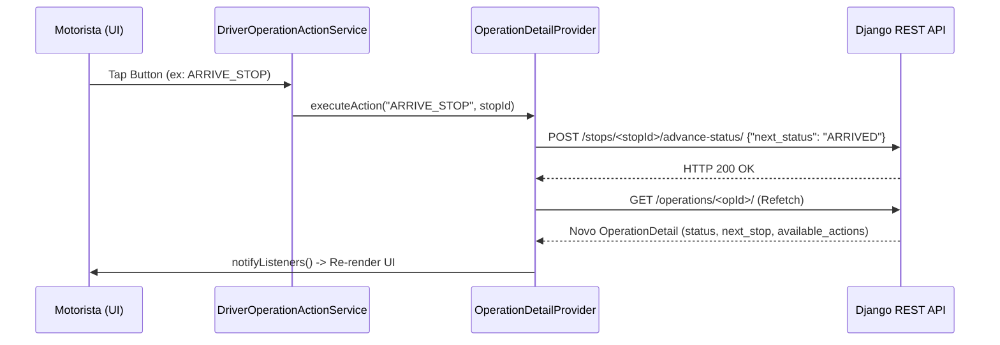

# Driver App Operational Flow & Architecture

Este documento descreve a arquitetura cliente/servidor e o fluxo de dados entre o aplicativo móvel do motorista (`rotta_driver`) e o backend do **Rotta AI Core**.

---

## 1. Princípio da Autoridade do Domínio
O aplicativo Flutter atua estritamente como um cliente passivo e **não decide** regras de transição logísticas ou validade de status.
1. O backend expõe o status atual, as ações permitidas (`available_actions`) e a próxima parada sequencial (`next_stop`).
2. O Flutter renderiza botões unicamente para as ações listadas em `available_actions`.
3. Ao acionar uma ação, o Flutter chama o endpoint correspondente no backend e executa um refetch completo do detalhe da operação para obter o novo estado consolidado.

---

## 2. Estrutura de Contratos da API (Mobile)

### Detalhe da Operação (`/api/v1/driver/operations/<uuid>/`)
Retorna o payload completo da viagem, incluindo:
```json
{
  "id": "2e3d8cac-8daa-4fb2-af0b-41c5f49c8a93",
  "status": "IN_TRANSIT",
  "reference_code": "ROT-10029",
  "next_stop": {
    "id": "stop-uuid-3",
    "sequence": 3,
    "stop_type": "DELIVERY",
    "status": "ARRIVED",
    "has_pod": false
  },
  "available_actions": [
    "REPORT_INCIDENT",
    "SUBMIT_POD",
    "COMPLETE_STOP"
  ],
  "stops": [
    {
      "id": "stop-uuid-1",
      "sequence": 1,
      "stop_type": "PICKUP",
      "status": "COMPLETED",
      "has_pod": false
    },
    {
      "id": "stop-uuid-2",
      "sequence": 2,
      "stop_type": "PICKUP",
      "status": "COMPLETED",
      "has_pod": false
    },
    {
      "id": "stop-uuid-3",
      "sequence": 3,
      "stop_type": "DELIVERY",
      "status": "ARRIVED",
      "has_pod": false
    }
  ]
}
```

---

## 3. Fluxo de Transições no Flutter

Toda a lógica de conversão de ações em chamadas técnicas de API está isolada em [DriverOperationActionService](file:///home/marcelo/projetos/rotta/apps/rotta_driver/lib/features/operations/presentation/services/driver_operation_action_service.dart).



---

## 4. Tratamento de Concorrência e Conflito de Estados
Caso duas sessões concorrentes tentem avançar a mesma operação ou caso o status fique obsoleto (*stale*), a API retornará HTTP 409 (Conflict).
O Flutter intercepta esse erro no try-catch do `_confirmAndExecute` e força um **refetch imediato** para atualizar as ações disponíveis de forma transparente para o motorista, garantindo que ele nunca tente enviar ações obsoletas.
